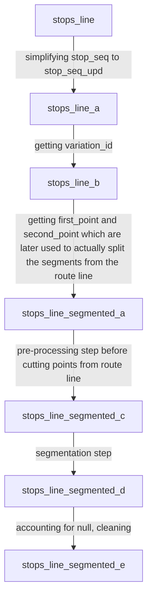

# GTFS Bus Stop Predictions Documentation

This document will go through the steps taken to create predictions for bus stop arrival, departure, and dwell times using pings (bus location and timestamp) from throughout the route.

## Original Data
1. Materialized View `vp_lines` </br>
Columns:
`agency_id` 
`closest_point`
`line`
`speed`
`stop_id`
`stop_sequence`
`timestamp`
`trip_id`
`ts`

2. Materialized View `stops_line` </br>
Columns:
`agency_id` 
`arrival_time_s`
`closest_point`
`departure_time_s`
`line`
`stop_id`
`stop_name`
`stop_sequence`
`trip_id`

It is important to note that I was only working with an `agency_id` of 0 which corresponds to just the Modesto data. The Modesto data is unique because the pings happen at given locations along each route, whereas other sets of data ping after a certain number of seconds.

## Original Data Pre-Processing 
### `vp_lines`
For vp_lines there are steps a - e to clean the data, get in pst, and add helpful columns. The final product is `vp_lines_e` which has the following columns: 
```
closest_point
timestamp
trip_id
trip_id_upd
trip_percent_complete
variation_id
```
`closest_point` is a `geometry` on where the location is. `trip_id` is the given trip_id by the city of modesto, but is not unique to the date so we created `trip_id_upd` (a hash of the date and `trip_id` concatenated) so that we can easily differentiate individual trips. `trip_percent_complete` is a measure of how far along the trip the ping is, and is determined by taking the `total distance traveled up to that point / total distance traveled on the whole trip`. It is used for comparison to the stops and is helpful in identifying which direction the bus is going in overlapping segments. Lastly, `variation_id` is a hash of a sequence of stops all concatenated. This gives us a unique identifier for every route. 

### `stops_line`
For `stops_line` we needed to take the input data and segment all the `line`'s on a stop by stop basis. This allows us to later snap the pings from `vp_lines` to the segments before and after each stop. 

**Steps** 


At this point we have the data in a format that we can effectively use in our predictions algorithm.  

